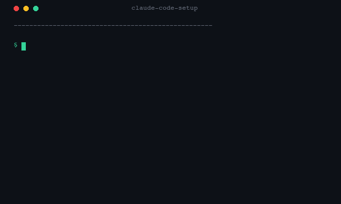

# Claude Code Setup

**Professional Claude Code workspace in one command. Free and open source.**

Configura um workspace profissional do Claude Code em um comando. Gratuito e open source.



---

## Install / Instalar

```bash
curl -fsSL https://raw.githubusercontent.com/tadeurosa-ai/claude-code-setup/main/install.sh | bash
```

Or clone and run locally / Ou clone e rode localmente:

```bash
git clone https://github.com/tadeurosa-ai/claude-code-setup
cd claude-code-setup
bash install.sh
```

**Requirements / Requisitos:** macOS or Linux · Git · Claude Code

---

## What's included / O que está incluído

| Component | Description |
|-----------|-------------|
| Folder structure | `~/.claude/` + `~/claude/` — organized workspace |
| `CLAUDE.md` | Persistent instructions Claude follows every session |
| 11 skills | `/daily` `/review` `/standup` `/backlog` `/debug` `/pr` `/deploy-check` `/estimate` `/context` `/client-report` `/weekly` |
| Hooks | Automated actions on Claude events (notify when task done) |
| Memory system | `~/.claude/memory/` — persistent context across sessions |
| Backup & restore | `backup.sh` + `restore.sh` for migration or reinstall |

> **Language note:** Skills and CLAUDE.md are in Brazilian Portuguese by default. Claude will respond in Portuguese unless you edit `~/.claude/CLAUDE.md`. Simply change the language instruction in that file to switch.

---

## Skills

| Skill | What it does |
|-------|-------------|
| `/daily` | Day summary — open tasks, project context, next steps |
| `/review` | Code review focused on security, quality and best practices |
| `/standup` | Generates standup message from recent work |
| `/backlog` | Saves ideas and tasks without breaking your flow |
| `/debug` | Systematic debugging — diagnosis before fix |
| `/pr` | Pull request description from current diff |
| `/deploy-check` | Pre-deploy checklist for the current branch |
| `/estimate` | Time and complexity estimate for a task |
| `/context` | Summarizes current project context for handoff |
| `/client-report` | Progress report formatted for client communication |
| `/weekly` | Weekly summary — what shipped, what's next |

---

## Backup, migrate, restore

Moving to a new machine? Formatting?

```bash
# Before formatting — backup
bash backup.sh

# After installing Claude Code on new machine — restore
bash restore.sh
```

The restore script auto-detects backups in iCloud, Google Drive, Downloads and Desktop.

---

## Requirements

- macOS 12+ or Linux
- Claude Code ([claude.ai/code](https://claude.ai/code)) with Pro or Max plan
- Git

---

## License

CC BY-NC-ND 4.0 — personal use permitted. Redistribution or modification without authorization prohibited.

© Tadeu Rosa, 2026
